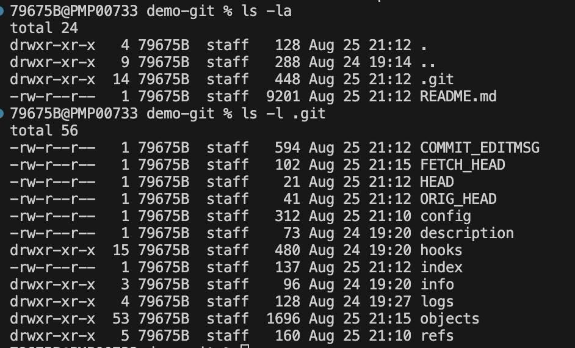
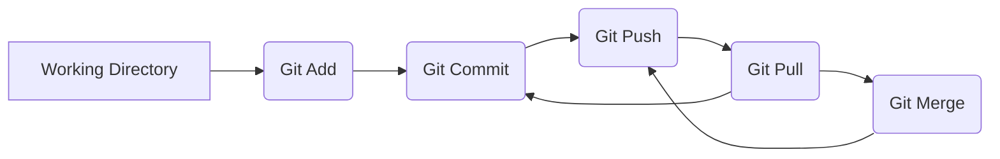

# Manipulation des fichiers git

Git est un logiciel de gestion de versions décentralisé. C'est un logiciel libre créé par Linus Torvalds, auteur du noyau Linux, et distribué selon les termes de la licence publique générale GNU version 2.

Git permet de gérer des projets, de suivre l'évolution du code source et de coordonner le travail fait par plusieurs personnes. Il permet de revenir à des versions antérieures du projet, de gérer très facilement les différentes branches de développement et de maintenir des versions distinctes du projet.

Un dépôt git est un dossier qui contient les fichiers du projet ainsi que les informations de versionnage. Il est possible de créer un dépôt git à partir d'un dossier existant ou de créer un dossier à partir d'un dépôt git.

Le concept de commit est au coeur de git. Un commit est une sauvegarde de l'état des fichiers à un instant donné. Un commit représente un ensemble cohérent de modifications. 


## Installer git

Pour installer git, il faut télécharger le logiciel sur le site officiel : https://git-scm.com/downloads

## Configurer git

Avant de commencer à utiliser git, il faut configurer son nom et son email.

## Configurer son nom
```bash
git config --global user.name "John Doe"
```

## Configurer son email
```bash
git config --global user.email
```

## Créer un nouveau dépôt git

Afin d'initialiser un dépôt git, il faut se placer dans le répertoire de travail et exécuter la commande suivante :
```bash
git init
```

Cela crée un dossier .git qui contient les informations de versionnage. Il est possible de voir ce dossier en affichant les fichiers cachés. Par exemple, sous Linux ou avec git-bash, il faut exécuter la commande suivante :
```bash
ls -a
```


## Les trois états d'un fichier

Un fichier peut être dans trois états différents dans git :
- **untracked**  : le fichier n'est pas dans le dépôt git,
- **not staged** : le fichier est dans le dépôt git mais n'a pas été modifié depuis le dernier commit
- **staged** : le fichier est dans le dépôt git et a été modifié depuis le dernier commit


## Les trois zones d'un dépôt git

Un dépôt git est composé de trois zones :
- **le répertoire de travail** : c'est le dossier qui contient les fichiers du projet
- **l'index** : c'est la zone qui contient les fichiers qui seront commités
- **l'historique** : c'est la zone qui contient les commits

Lors de l'initialisation d'un dépôt git, le répertoire de travail et l'index sont identiques. Lorsqu'on ajoute un fichier, à l'index, il est copié dans l'index. Lorsqu'on commit, les fichiers de l'index sont copiés dans l'historique.


## Ajouter des fichiers à l'index

Pour ajouter un fichier à l'index, il faut exécuter la commande suivante :
```bash
git add <file>
```

Pour ajouter tous les fichiers à l'index, il faut exécuter la commande suivante :
```bash
git add .
```

Une fois le fichier ajouté à l'index, il est possible de voir son état avec la commande suivante :
```bash
git status
```

Les fichiers qui sont dans l'index sont affichés en vert. Les fichiers qui ne sont pas dans l'index sont affichés en rouge. Les fichiers qui ont été modifiés depuis le dernier commit sont affichés en rouge. Les fichiers qui ont été modifiés et ajoutés à l'index sont affichés en vert.

## Supprimer un fichier de l'index
```bash
git rm <file>
```

## Supprimer un fichier du disque et de l'index
```bash
git rm -f <file>
```

## Supprimer un fichier du disque mais pas de l'index
```bash
git rm --cached <file>
```

## Renommer un fichier
```bash
git mv <old> <new>
```

## Déplacer un fichier
```bash
git mv <old> <new>
```

## Commiter les fichiers de l'index dans l'historique

Pour commiter les fichiers de l'index, il faut exécuter la commande suivante :
```bash
git commit
```

Cette commande ouvre un éditeur de texte pour saisir le message du commit. Il est possible de saisir le message du commit directement dans la ligne de commande avec la commande suivante :
```bash 
git commit -m "message du commit"
```

## Afficher l'historique des commits

Pour afficher l'historique des commits, il faut exécuter la commande suivante :
```bash
git log
```

## Afficher les différences entre l'index et le répertoire de travail

Pour afficher les différences entre l'index et le répertoire de travail, il faut exécuter la commande suivante :
```bash
git diff
```

## Afficher les différences entre l'index et le dernier commit

Pour afficher les différences entre l'index et le dernier commit, il faut exécuter la commande suivante :
```bash
git diff --cached
```

## Afficher les différences entre le répertoire de travail et le dernier commit

Pour afficher les différences entre le répertoire de travail et le dernier commit, il faut exécuter la commande suivante :
```bash
git diff HEAD
```

## Annuler les modifications d'un fichier de l'index

Pour annuler les modifications d'un fichier de l'index, il faut exécuter la commande suivante :
```bash
git reset HEAD <file>
```

## Annuler les modifications de tous les fichiers de l'index

Pour annuler les modifications de tous les fichiers de l'index, il faut exécuter la commande suivante :
```bash
git reset HEAD
```

### Modifier le dernier commit

Il est possible de modifier le dernier commit avec la commande suivante :
```bash
git commit --amend
```

Cette commande ouvre un éditeur de texte qui permet de modifier le message du dernier commit. En ajoutant des fichiers à l'index avant d'exécuter cette commande, il est possible de modifier le contenu du dernier commit. Cette commande est utile pour corriger un message de commit ou pour ajouter des fichiers oubliés dans le dernier commit.

## Annuler un commit

Il est possible d'annuler le dernier commit avec la commande suivante :
```bash
git reset --soft HEAD^
```

Il est possible d'annuler le dernier commit et de supprimer les fichiers de l'index avec la commande suivante :
```bash
git reset --hard HEAD^
```

Le caractère ^ signifie le commit précédent. Il est possible d'annuler plusieurs commits en ajoutant plusieurs ^. Il est aussi possible d'utilisé le charactère ~ pour annuler plusieurs commits. Par exemple, pour annuler les 3 derniers commits, il faut exécuter la commande suivante :
```bash
git reset --soft HEAD~3
```

## Ré-écrire l'historique

Il est possible de modifier l'historique avec la commande suivante :
```bash
git rebase -i HEAD~3
```

Cette commande ouvre un éditeur de texte qui permet de modifier l'historique. Il est possible de modifier le message d'un commit, de supprimer un commit ou de fusionner deux commits.

### Modifier le message d'un commit

Pour modifier le message d'un commit, il faut remplacer le mot pick par reword devant le commit.

### Supprimer un commit

Pour supprimer un commit, il faut supprimer la ligne correspondant au commit.

### Fusionner deux commits

Pour fusionner deux commits, il faut remplacer le mot pick par squash devant le commit.

## Annuler un commit publié

Il est possible d'annuler un commit publié avec la commande suivante :
```bash
git revert <commit>
```

### Afficher l'historique des commits

Pour afficher l'historique des commits, il faut exécuter la commande suivante :
```bash
git log
```

Il possible de filtrer l'historique des commits avec différentes options. Par exemple, pour afficher les 3 derniers commits d'un utilisateur, il faut exécuter la commande suivante :
```bash
git log --author="John Doe" -n 3
```

Pour afficher les commits d'une période, il faut exécuter la commande suivante :
```bash
git log --since="2018-01-01" --until="2018-12-31"
```

Pour afficher les commits d'un fichier, il faut exécuter la commande suivante :
```bash
git log -- <file>
```

## Afficher les différences entre deux commits

Pour afficher les différences entre deux commits, il faut exécuter la commande suivante :
```bash
git diff <commit1> <commit2>
```

Par exemple pour afficher la différence entre le dernier commit et l'avant dernier commit, il faut exécuter la commande suivante :
```bash
git diff HEAD HEAD^
```

## Identifier l'auteur d'une ligne de code

Pour identifier l'auteur d'une ligne de code, il faut exécuter la commande suivante :
```bash
git blame <file>
```

## Publier vers un dépôt git distant

Pour publier un dépôt git, il faut exécuter la commande suivante :
```bash
git remote add origin <url>
```

Pour envoyer les commits vers le dépôt distant, il faut exécuter la commande suivante :
```bash
git push -u origin master
```

## Récupérer les commits d'un dépôt git

Pour récupérer un dépôt git distant en local, il faut exécuter la commande suivante :
```bash
git clone <url>
```

Dans le repository local, il est possible de récupérer les commits du dépôt distant avec la commande suivante :
```bash
git pull
```

Ci-dessous un schéma qui résume le fonctionnement de base de git :


