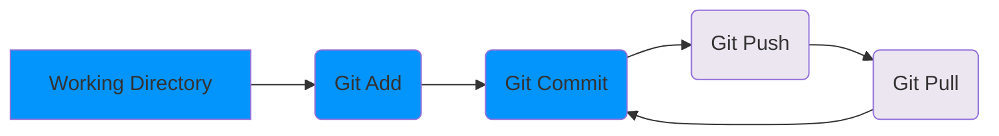

Le cas d'usage basique de git est de modifier des fichiers en local, puis de les envoyer vers un dépôt distant. Il est ensuite possible de récupérer les modifications du dépôt distant en local.

Les fichiers sont modifiés en local, puis ajoutés à l'index avec la commande `git add`. Les fichiers de l'index sont commités avec la commande `git commit`. Les commits sont ensuite envoyés vers le dépôt distant avec la commande `git push`. Les commits du dépôt distant sont récupérés avec la commande `git pull`.



## init - Initialiser un dépôt git

Afin d'initialiser un dépôt git, il faut se placer dans le répertoire de travail et exécuter la commande suivante :
```bash
git init
```

Cela crée un dossier .git qui contient les informations de versionnage. Il est possible de voir ce dossier en affichant les fichiers cachés. Par exemple, sous Linux ou avec git-bash, il faut exécuter la commande suivante :
```bash
ls -a
```


Un dépôt git est composé de trois zones :

- **le répertoire de travail** : c'est le dossier qui contient les fichiers du projet
- **l'index** : c'est la zone qui contient les fichiers qui seront commités
- **l'historique** : c'est la zone qui contient les commits

Lors de l'initialisation d'un dépôt git, le répertoire de travail et l'index sont identiques. Lorsqu'on **add** un fichier à l'index, il est copié dans celui-ci. Lorsqu'on **commit**, les fichiers de l'index sont copiés dans l'historique.

La **zone d’index**, nommée **staging** en anglais, est une zone temporaire dans laquelle on ajoute les fichiers qui feront partie du prochain instantané. Dans le langage de Git, les instantanés se nomment des **commits**.


Dans l'ide Visual Studio Code, les zones sont représentées dans l'onglet source control. **Changes** correspond au répertoire de travail, **Staged Changes** correspond à l'index et **Commits** correspond à l'historique.


## add - Ajouter des fichiers à l'index

Ajoute le fichier à l'index
```bash
git add <file>
```

Ajoute tous les fichiers du répertoire de travail à l'index
```bash
git add .
```

Ajoute plusieurs fichiers à l'index
```bash
git add <file1> <file2>
```

Ajoute tous les fichiers correspondant à un pattern à l'index
```bash
git add *.txt
```

Ici, on ajoute tous les fichiers avec l'extension .txt à l'index.

## rm - Supprimer des fichiers de l'index

Efface le fichier de l'index mais pas du disque
```bash
git rm <file>
```

Efface le fichier de l'index et du disque
```bash
git rm -f <file>
```

Déplace/renomme le fichier dans l'index et sur le disque
```bash
git mv <old> <new>
```

## status - Afficher l'état des fichiers

Une fois le fichier ajouté à l'index, il est possible de voir son état avec la commande suivante :
```bash
git status
```


## commit - Commiter les fichiers de l'index dans l'historique

Pour commiter les fichiers de l'index, il faut exécuter la commande suivante :
```bash
git commit
```

Cette commande ouvre un éditeur de texte pour saisir le message du commit. Il est possible de saisir le message du commit directement dans la ligne de commande avec la commande suivante :
```bash 
git commit -m "message du commit"
```

Il est possible de modifier le dernier commit avec la commande suivante :
```bash
git commit --amend
```

Cette commande ouvre un éditeur de texte qui permet de modifier le message du dernier commit. En ajoutant des fichiers à l'index avant d'exécuter cette commande, il est possible de modifier le contenu du dernier commit. Cette commande est utile pour corriger un message de commit ou pour ajouter des fichiers oubliés dans le dernier commit.

## remote - Publier un dépôt git

Pour publier un dépôt git, il faut exécuter la commande suivante :
```bash
git remote add origin <url>
```

## clone - Récupérer un dépôt git distant en local

Pour récupérer un dépôt git distant en local, il faut exécuter la commande suivante :
```bash
git clone <url>
```

## push - Envoyer les commits vers un dépôt git
Pour envoyer les commits vers le dépôt distant, il faut exécuter la commande suivante :
```bash
git push -u origin master
```

## pull - Récupérer les commits du dépôt distant

Dans le repository local, il est possible de récupérer les commits du dépôt distant avec la commande suivante :
```bash
git pull
```


