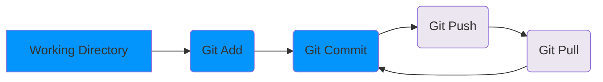
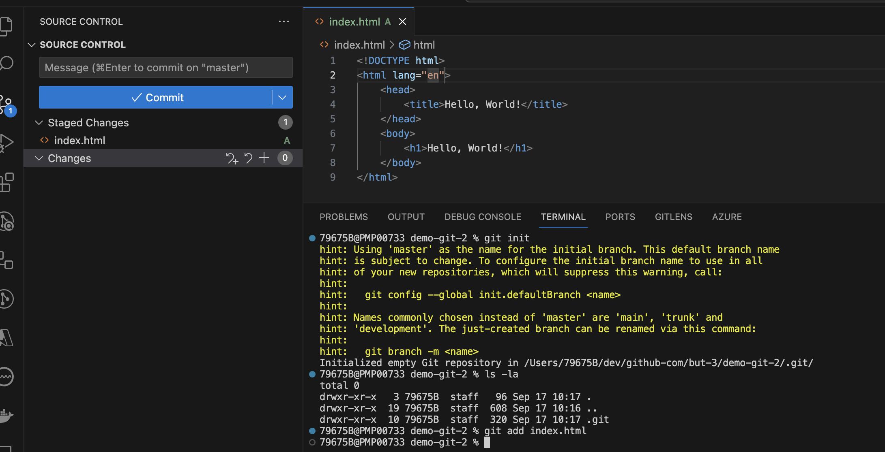
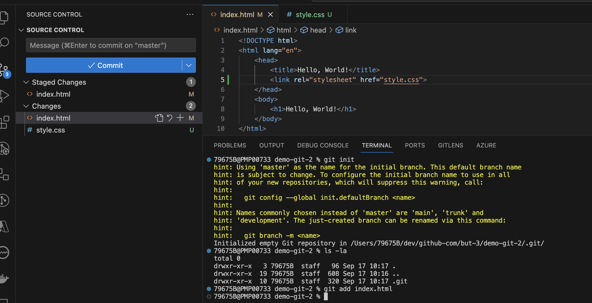
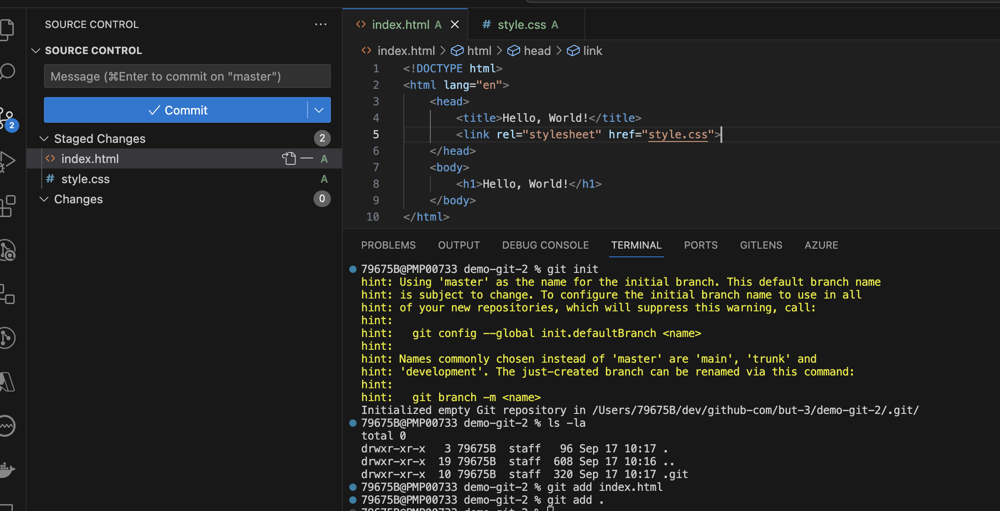
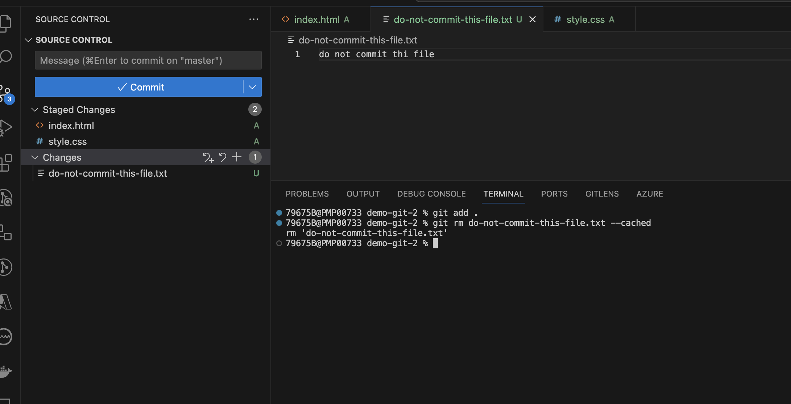
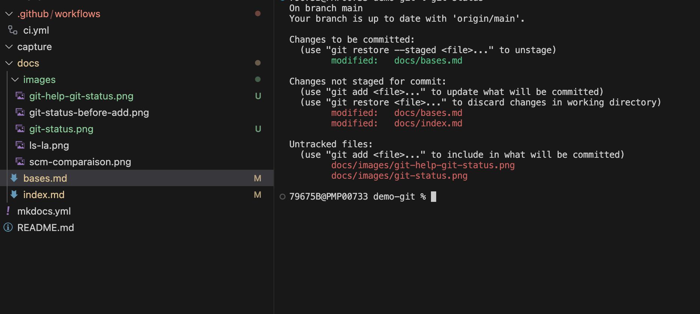
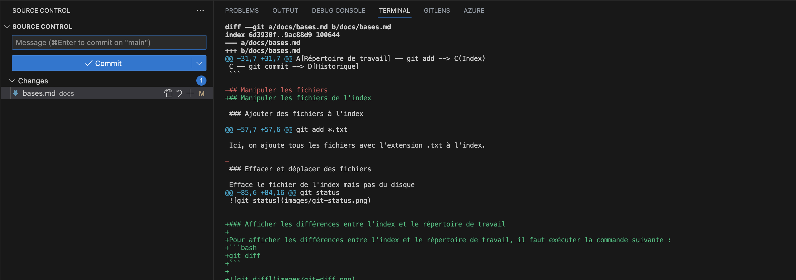
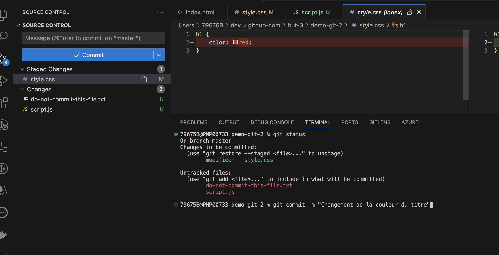
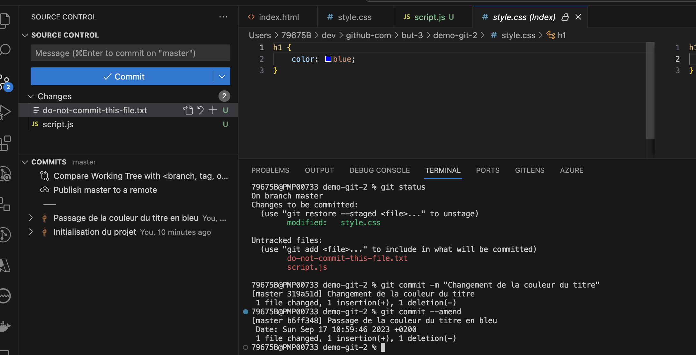
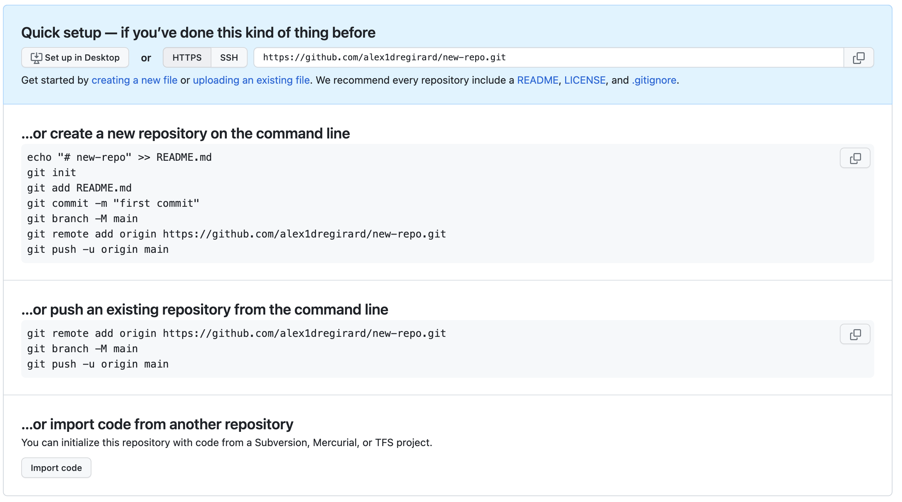

Le cas d'usage basique de git est de modifier des fichiers en local, puis de les envoyer vers un dépôt distant. Il est ensuite possible de récupérer les modifications du dépôt distant en local.

Les fichiers sont modifiés en local, puis ajoutés à l'index avec la commande `git add`. Les fichiers de l'index sont commités avec la commande `git commit`. Les commits sont ensuite envoyés vers le dépôt distant avec la commande `git push`. Les commits du dépôt distant sont récupérés avec la commande `git pull`.



## init - Initialiser un dépôt git

Afin d'initialiser un dépôt git, il faut se placer dans le répertoire de travail et exécuter la commande suivante :
```bash
git init
```

Cela crée un dossier .git qui contient les informations de versionnage. Il est possible de voir ce dossier en affichant les fichiers cachés. Par exemple, sous Linux ou avec git-bash, il faut exécuter la commande suivante :
```bash
ls -a
```


Un dépôt git est composé de trois zones :

- **le répertoire de travail** : c'est le dossier qui contient les fichiers du projet
- **l'index** : c'est la zone qui contient les fichiers qui seront commités
- **l'historique** : c'est la zone qui contient les commits

Lors de l'initialisation d'un dépôt git, le répertoire de travail et l'index sont identiques. Lorsqu'on **add** un fichier à l'index, il est copié dans celui-ci. Lorsqu'on **commit**, les fichiers de l'index sont copiés dans l'historique.

La **zone d’index**, nommée **staging** en anglais, est une zone temporaire dans laquelle on ajoute les fichiers qui feront partie du prochain instantané. Dans le langage de Git, les instantanés se nomment des **commits**.


Dans l'ide Visual Studio Code, les zones sont représentées dans l'onglet source control. **Changes** correspond au répertoire de travail, **Staged Changes** correspond à l'index et **Commits** correspond à l'historique.


## add - Ajouter des fichiers à l'index

Ajoute le fichier à l'index
```bash
git add <file>
```

Avant l'ajout du fichier à l'index, le fichier n'est pas présent dans l'onglet **Staged Changes** de Visual Studio Code. Il est présent dans l'onglet **Changes**.


Après l'ajout du fichier à l'index, le fichier est présent dans l'onglet **Staged Changes** de Visual Studio Code. Il n'est plus présent dans l'onglet **Changes**.



Si l'on modifie le fichier index.html, le fichier est présent dans l'onglet **Changes** de Visual Studio Code et que l'on ajoute par exemple le fichier style.css à l'index, les deux fichiers sont présents dans l'onglet **Staged Changes** de Visual Studio Code.




Ajoute tous les fichiers du répertoire de travail à l'index
```bash
git add .
```



Ajoute plusieurs fichiers à l'index
```bash
git add <file1> <file2>
```

Ajoute tous les fichiers correspondant à un pattern à l'index
```bash
git add *.txt
```

Ici, on ajoute tous les fichiers avec l'extension .txt à l'index.

## rm - Supprimer des fichiers de l'index

Efface le fichier de l'index mais pas du disque
```bash
git rm <file> --cached
```


Dans cet exemple, le fichier `do-not-commit-this-file.txt` a été poussé dans l'index par erreur. Il faut donc l'enlever de l'index. Pour cela, il faut exécuter la commande suivante :
```bash
git rm do-not-commit-this-file.txt --cached
```

Nous verrons un peu plus tard, que si l'on ne souhaite pas qu'un fichier soit versionné, on peut l'ajouter dans le fichier .gitignore.



Déplace/renomme le fichier dans l'index et sur le disque
```bash
git mv <old> <new>
```

## status - Afficher l'état des fichiers

Une fois le fichier ajouté à l'index, il est possible de voir son état avec la commande suivante :
```bash
git status
```



## diff - Afficher les différences entre les fichiers

Il est possible de voir les différences entre les fichiers avec la commande suivante :
```bash
git diff
```




## commit - Commiter les fichiers de l'index dans l'historique

Pour commiter les fichiers de l'index, il faut exécuter la commande suivante :
```bash
git commit
```

Cette commande ouvre un éditeur de texte pour saisir le message du commit. Il est possible de saisir le message du commit directement dans la ligne de commande avec la commande suivante :
```bash 
git commit -m "message du commit"
```



Une fois le commit effectué, les fichiers de l'index sont copiés dans l'historique. L'index est vidé. Dans l'onglet **Commits** de Visual Studio Code, on peut voir le message du commit et les fichiers qui ont été commités.


Il est possible de modifier le dernier commit avec la commande suivante :
```bash
git commit --amend
```

Cette commande ouvre un éditeur de texte qui permet de modifier le message du dernier commit. En ajoutant des fichiers à l'index avant d'exécuter cette commande, il est possible de modifier le contenu du dernier commit. Cette commande est utile pour corriger un message de commit ou pour ajouter des fichiers oubliés dans le dernier commit.



Lorsque l'on commit il est important de respecter certaines règles, voir [Messages de commit](messages-commit.md).


## remote - Publier un dépôt git

Le travail effectué en local peut être publié sur un dépôt git distant. Il existe plusieurs services qui permettent d'héberger des dépôts git. Les plus connus sont GitHub, GitLab et Bitbucket. Ces services permettent de publier des dépôts git publics ou privés.

Afin de publier un dépôt git, il faut créer un dépôt sur le service d'hébergement. Une fois le dépôt créé, il faut récupérer l'url du dépôt. Il existe deux types d'url : https et ssh. L'url https est plus simple à utiliser car elle ne nécessite pas de configuration particulière. L'url ssh nécessite de configurer une clé ssh sur le service d'hébergement. L'url ssh est plus sécurisée car elle utilise une clé ssh pour s'authentifier. L'url https utilise un nom d'utilisateur et un mot de passe pour s'authentifier.



Dans la copie d'écran ci-dessus, une aide est affichée et propose différentes commandes pour publier un dépôt git. Il est possible de publier un dépôt git existant ou de créer un nouveau dépôt git. Dans notre cas, nous allons publier un dépôt git existant. Il faut donc exécuter la commande suivante :
```bash
git remote add origin <url>
``` 

## clone - Récupérer un dépôt git distant en local

Une fois que le dépôt git est publié, il est possible de le récupérer en local. 


Dans la copie d'écran ci-dessus, une aide est affichée et propose différentes commandes pour récupérer un dépôt git. Il faut donc exécuter la commande suivante :

```bash
git clone <url>
```

## push - Envoyer les commits vers un dépôt git
Pour envoyer les commits vers le dépôt distant, il faut exécuter la commande suivante :
```bash
git push -u origin main
```

## pull - Récupérer les commits du dépôt distant

Dans le repository local, il est possible de récupérer les commits du dépôt distant avec la commande suivante :
```bash
git pull
```

## gitignore - Ignorer des fichiers

Il est possible d'ignorer des fichiers avec le fichier .gitignore. Ce fichier contient la liste des fichiers à ignorer. Il est possible d'ignorer des fichiers, des dossiers ou des patterns. Voici un exemple de fichier .gitignore :

```
# Ignore les fichiers avec l'extension .env
*.env

# Ignore le dossier node_modules
node_modules/

# Ignore les fichiers avec l'extension .log dans le dossier logs
logs/*.log
```

On ignore les fichiers avec l'extension .env, le dossier node_modules et les fichiers avec l'extension .log dans le dossier logs. Pour un projet node.js, il est conseillé d'ignorer le dossier node_modules. En effet, ce dossier contient les dépendances du projet. Il est inutile de les versionner car elles peuvent être installées avec la commande `npm install`.

## README.md - Documenter un projet

Il est conseillé de documenter un projet avec un fichier README.md. Ce fichier contient la documentation du projet. Il est possible d'utiliser le langage markdown pour mettre en forme le texte. Ce fichier est affiché sur la page d'accueil du dépôt GitHub. Il est donc important de le rédiger pour donner des informations sur le projet.