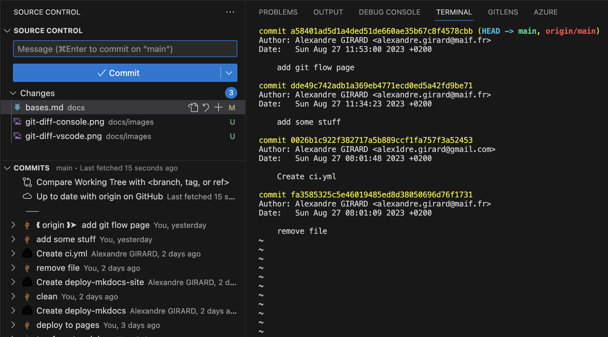

# Bases de git

## Créer un nouveau dépôt git

Afin d'initialiser un dépôt git, il faut se placer dans le répertoire de travail et exécuter la commande suivante :
```bash
git init
```

Cela crée un dossier .git qui contient les informations de versionnage. Il est possible de voir ce dossier en affichant les fichiers cachés. Par exemple, sous Linux ou avec git-bash, il faut exécuter la commande suivante :
```bash
ls -a
```


## Les trois zones d'un dépôt git

Un dépôt git est composé de trois zones :

- **le répertoire de travail** : c'est le dossier qui contient les fichiers du projet
- **l'index** : c'est la zone qui contient les fichiers qui seront commités
- **l'historique** : c'est la zone qui contient les commits

Lors de l'initialisation d'un dépôt git, le répertoire de travail et l'index sont identiques. Lorsqu'on ajoute un fichier, à l'index, il est copié dans l'index. Lorsqu'on commit, les fichiers de l'index sont copiés dans l'historique.

La **zone d’index**, nommée **staging** en anglais, est une zone temporaire dans laquelle on ajoute les fichiers qui feront partie du prochain instantané. Dans le langage de Git, les instantanés se nomment des **commits**.


## Manipuler les fichiers de l'index

### Ajouter des fichiers à l'index

Pour ajouter un fichier à l'index, il faut exécuter la commande suivante :
```bash
git add <file>
```

Pour ajouter tous les fichiers à l'index, il faut exécuter la commande suivante :
```bash
git add .
```

Pour ajouter certains fichiers à l'index, il faut exécuter la commande suivante :
```bash
git add <file1> <file2>
```

Ou encore avec un joker :
```bash
git add *.txt
```

Ici, on ajoute tous les fichiers avec l'extension .txt à l'index.

### Effacer et déplacer des fichiers

Efface le fichier de l'index mais pas du disque
```bash
git rm <file>
```

Efface le fichier de l'index et du disque
```bash
git rm -f <file>
```

Déplace/renomme le fichier dans l'index et sur le disque
```bash
git mv <old> <new>
```

### Afficher l'état des fichiers

Une fois le fichier ajouté à l'index, il est possible de voir son état avec la commande suivante :
```bash
git status
```


### Afficher les différences entre l'index et le répertoire de travail

Pour afficher les différences entre l'index et le répertoire de travail, il faut exécuter la commande suivante :
```bash
git diff
```


Il est possible d'afficher les différences entre l'index et le répertoire de travail pour un fichier en particulier avec la commande suivante :
```bash
git diff <file>
```

Il est possible de voir ces différences directement dans l'ide. Par exemple, avec Visual Studio Code, il faut cliquer sur le fichier dans l'onglet source control.


## Travailler avec l'historique
### Commiter les fichiers de l'index dans l'historique

Pour commiter les fichiers de l'index, il faut exécuter la commande suivante :
```bash
git commit
```

Cette commande ouvre un éditeur de texte pour saisir le message du commit. Il est possible de saisir le message du commit directement dans la ligne de commande avec la commande suivante :
```bash 
git commit -m "message du commit"
```

### Afficher l'historique des commits

Pour afficher l'historique des commits, il faut exécuter la commande suivante :
```bash
git log
```

Il est possible de filtrer l'historique des commits avec différentes options. 

Par exemple, pour afficher les 3 derniers commits, on peut exécuter la commande suivante :
```bash
git log -n 3
```



Pour afficher les commits d'une période :
```bash
git log --since="2022-01-01" --until="2022-12-31"
```

Pour afficher les commits d'un fichier :
```bash
git log -- <file>
```

Les options de filtrage peuvent être combinées. Par exemple, pour afficher les 3 derniers commits d'un utilisateur sur un fichier :
```bash
git log --author="John Doe" -n 3 -- <file>
```

## Afficher les différences avec l'historique

Pour afficher les différences entre l'index et le dernier commit, il faut exécuter la commande suivante :
```bash
git diff --cached
```

Pour afficher les différences entre le répertoire de travail et le dernier commit, il faut exécuter la commande suivante :
```bash
git diff HEAD
```

## Modifier le dernier commit

Il est possible de modifier le dernier commit avec la commande suivante :
```bash
git commit --amend
```

Cette commande ouvre un éditeur de texte qui permet de modifier le message du dernier commit. En ajoutant des fichiers à l'index avant d'exécuter cette commande, il est possible de modifier le contenu du dernier commit. Cette commande est utile pour corriger un message de commit ou pour ajouter des fichiers oubliés dans le dernier commit.

## Annuler un commit

Il est possible d'annuler le dernier commit avec la commande suivante :
```bash
git reset --soft HEAD^
```

Si l'on souhaite annuler le dernier commit et supprimer les fichiers de l'index, il faut exécuter la commande suivante :
```bash
git reset --hard HEAD^
```

Le caractère ^ signifie le commit précédent. Il est possible d'annuler plusieurs commits en ajoutant plusieurs ^. Il est aussi possible d'utilisé le charactère ~ pour annuler plusieurs commits. Par exemple, pour annuler les 3 derniers commits, il faut exécuter la commande suivante :
```bash
git reset --soft HEAD~3
```

## Ré-écrire l'historique

Il est possible de modifier l'historique avec la commande suivante :
```bash
git rebase -i HEAD~3
```

Cette commande ouvre un éditeur de texte qui permet de modifier l'historique. Il est possible de modifier le message d'un commit, de supprimer un commit ou de fusionner deux commits.

### Modifier le message d'un commit

Pour modifier le message d'un commit, il faut remplacer le mot pick par reword devant le commit.

### Supprimer un commit

Pour supprimer un commit, il faut supprimer la ligne correspondant au commit.

### Fusionner deux commits

Pour fusionner deux commits, il faut remplacer le mot pick par squash devant le commit.

Il est possible de fusionner plusieurs commits en ajoutant plusieurs squash devant les commits.

Ces actions peuvent aussi être faite directement dans l'ide, ce qui peut être plus simple. 

Par exemple avec l'extension git lens de Visual Studio Code:


## Annuler un commit publié

Il est possible d'annuler un commit publié avec la commande suivante :
```bash
git revert <commit>
```

## Afficher les différences entre deux commits

Pour afficher les différences entre deux commits, il faut exécuter la commande suivante :
```bash
git diff <commit1> <commit2>
```

Par exemple pour afficher la différence entre le dernier commit et l'avant dernier commit, il faut exécuter la commande suivante :
```bash
git diff HEAD HEAD^
```

## Identifier l'auteur d'une ligne de code

Pour identifier l'auteur d'une ligne de code, il faut exécuter la commande suivante :
```bash
git blame <file>
```

Cela permet de voir qui a modifié une ligne de code et à quel moment. Cela peut être utile pour identifier l'auteur d'un bug.
Dans Visual Studio Code, il est possible d'afficher les informations de git blame en survolant une ligne de code.


## Publier vers un dépôt git distant

Pour publier un dépôt git, il faut exécuter la commande suivante :
```bash
git remote add origin <url>
```

Pour envoyer les commits vers le dépôt distant, il faut exécuter la commande suivante :
```bash
git push -u origin master
```

## Récupérer les commits d'un dépôt git

Pour récupérer un dépôt git distant en local, il faut exécuter la commande suivante :
```bash
git clone <url>
```

Dans le repository local, il est possible de récupérer les commits du dépôt distant avec la commande suivante :
```bash
git pull
```

Ci-dessous un schéma qui résume le fonctionnement de base de git :


## Autres commandes utiles

### Déplacer un fichier

Pour déplacer ou renommer un fichier, il faut exécuter la commande suivante :

```bash
git mv <old> <new>
```
