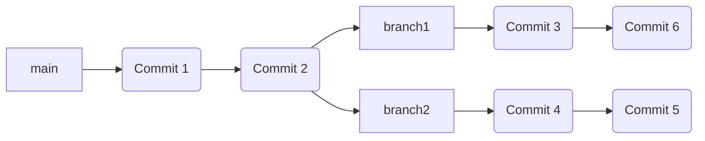
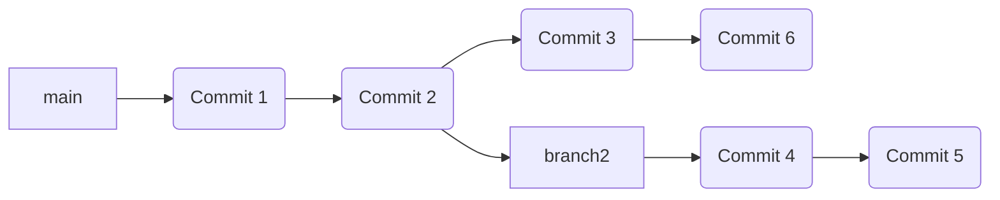

# Les Branches

Les branches constituent un élément central de Git. Elles permettent de travailler sur plusieurs versions d'un même projet en parallèle. Elles sont, par exemple, très utiles pour travailler sur des fonctionnalités en cours de développement sans impacter le code de production. Ceci permet aussi de développer une nouvelle fonctionalité sur une branche dédiée sans risquer d’altérer le code de la branche principale, qui reste stable à tout moment.

Lors de la création d'une branche, celle-ci est dupliquée à partir de la branche courante. Les modifications apportées à cette branche n'impactent pas les autres branches. Une fois les modifications terminées, il est possible de fusionner la branche avec la branche courante.



Dans cet exemple, les branches `branch1` et `branch2` ont été créées à partir de la branche `main` qui contenait à ce moment là 2 commits. 

Les branches ont ensuite évoluées de manière indépendantes. La branche `branch1` a été modifiée avec les commits `Commit 3` et `Commit 6`. La branche `branch2` a été modifiée avec les commits `Commit 4` et `Commit 5`.


Une fois les évolutions d'une branche terminées, elles peuvent être fusionnées avec la branche courante.

 
Dans notre exemple, la branche `branch1` a été fusionnée avec la branche `main`. Les commits `Commit 2` et `Commit 4` ont été ajoutés à la branche `main`. La branche `branch2` n'a pas été fusionnée. Les commits `Commit 3` et `Commit 5` ne sont donc pas présents dans la branche `main`.



Si ensuite la branche `branch2` est fusionnée avec la branche `main`, les commits `Commit 3`, `Commit 4` et `Commit 5` seront ajoutés à la branche `main`.


## Lister les branches

Pour lister les branches d'un projet, il suffit d'utiliser la commande `git branch`.

```bash
git branch
```

Cette commande affiche la liste des branches du projet. La branche courante est indiquée par un astérisque.

```bash
* main
  branch1
  branch2
```

L'option `-a` permet d'afficher toutes les branches du projet, y compris les branches distantes.

```bash
git branch -a
```

Cette commande affiche la liste des branches du projet, y compris les branches distantes. La branche courante est indiquée par un astérisque.

```bash
* main
  branch1
  branch2
  remotes/origin/HEAD -> origin/main
  remotes/origin/main
  remotes/origin/branch1
  remotes/origin/branch2
```

L'option `-v` permet d'afficher les derniers commits de chaque branche.

```bash
git branch -v
```

Cette commande affiche la liste des branches du projet. La branche courante est indiquée par un astérisque.

```bash
* main   5f4a4b2 [origin/main] Update readme.md
  branch1 5f4a4b2 Update readme.md
  branch2 5f4a4b2 Update readme.md
```

## Créer une branche

Pour créer une branche, il suffit d'utiliser la commande `git branch` suivie du nom de la branche à créer.

```bash
git branch branch1
```

Cette commande crée une nouvelle branche nommée `branch1` à partir de la branche courante.

## Changer de branche

Pour changer de branche, il suffit d'utiliser la commande `git switch` suivie du nom de la branche à utiliser.

```bash
git switch branch1
```

Cette commande permet de passer de la branche `main` à la branche `branch1`. Il est aussi possible d'utiliser le mot clé `checkout` à la place de `switch`. Le mot clé `checkout` est déprécié et sera supprimé dans une prochaine version de Git.

```bash
git checkout branch1
```

## Fusionner une branche

Pour fusionner une branche avec la branche courante, il suffit d'utiliser la commande `git merge` suivie du nom de la branche à fusionner.

```bash
git merge branch1
```

Cette commande permet de fusionner la branche `branch1` avec la branche courante. La branche `branch1` n'est pas supprimée. 

Il est possible que la fusion de branches génère des conflits. Dans ce cas, il faut résoudre les conflits avant de pouvoir fusionner les branches. Nous verrons comment résoudre les conflits dans un prochain chapitre.

## Supprimer une branche

Pour supprimer une branche, il suffit d'utiliser la commande `git branch` suivie du nom de la branche à supprimer et de l'option `-d`.

```bash
git branch -d branch1
```

Cette commande supprime la branche `branch1`. Il n'est pas possible de supprimer la branche courante. Il faut donc changer de branche avant de pouvoir supprimer une branche.

## Renommer une branche

Pour renommer une branche, il suffit d'utiliser la commande `git branch` suivie du nom de la branche à renommer et de l'option `-m`.

```bash
git branch -m branch1 branch3
```

Cette commande renomme la branche `branch1` en `branch3`. Il n'est pas possible de renommer la branche courante. Il faut donc changer de branche avant de pouvoir renommer une branche.

## Références

- [Git Branches](https://git-scm.com/book/en/v2/Git-Branching-Branches-in-a-Nutshell)

