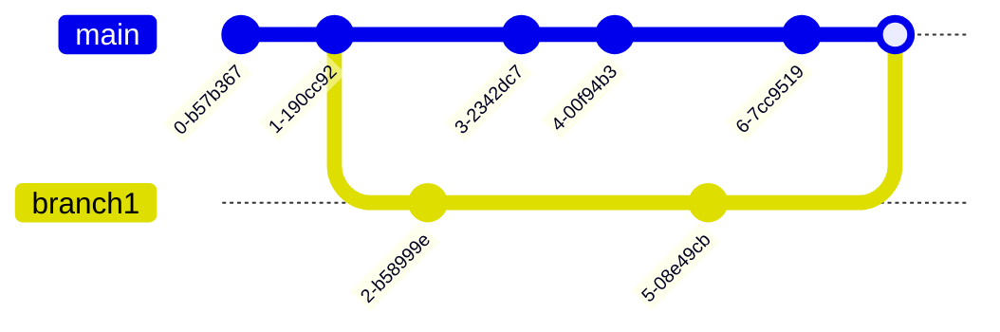

# Les Branches
 
Les branches constituent un élément central de Git. Elles permettent de travailler sur plusieurs versions d'un même projet en parallèle. Elles sont, par exemple, très utiles pour travailler sur des fonctionnalités en cours de développement sans impacter le code de production. Ceci permet aussi de développer une nouvelle fonctionalité sur une branche dédiée sans risquer d’altérer le code de la branche principale, qui reste stable à tout moment.

Lors de la création d'une branche, celle-ci est dupliquée à partir de la branche courante. Les modifications apportées à cette branche n'impactent pas les autres branches. Une fois les modifications terminées, il est possible de fusionner la branche avec la branche courante.


## Lister les branches

Pour lister les branches d'un projet, il suffit d'utiliser la commande `git branch`.

```bash
git branch
```

Cette commande affiche la liste des branches du projet. La branche courante est indiquée par un astérisque.

```bash
* main
  branch1
  branch2
```

L'option `-a` permet d'afficher toutes les branches du projet, y compris les branches distantes.

```bash
git branch -a
```

```bash
* main
  branch1
  branch2
  remotes/origin/HEAD -> origin/main
  remotes/origin/main
  remotes/origin/branch1
  remotes/origin/branch2
```

L'option `-v` permet d'afficher les derniers commits de chaque branche.

```bash
git branch -v
```

```bash
* main   5f4a4b2 [origin/main] Update readme.md
  branch1 5f4a4b2 Update readme.md
  branch2 5f4a4b2 Update readme.md
```

L'option `--list` permet d'afficher les branches qui correspondent à un motif.

```bash
git branch --list "feat*"
```

```bash
  feature1
  feature2
```

Enfin, quelques autres options s’avèrent utiles :

- `--contains <commit>` affiche toutes les branches contenant un commit donné,
- `--no-contains` fait le contraire de la précédente,
- `--no-merge` affiche les branches qui n’ont pas été mergées avec la branche courante,
- `--merge` fait le contraire de la précédente.


## Créer une branche

Pour créer une branche, il suffit d'utiliser la commande `git branch` suivie du nom de la branche à créer.

```bash
git branch branch1
```

Cette commande crée une nouvelle branche nommée `branch1` à partir de la branche courante.

## Changer de branche

Pour changer de branche, il suffit d'utiliser la commande `git switch` suivie du nom de la branche à utiliser.

```bash
git switch branch1
```

La branch `branch1` doit exister pour pouvoir changer de branche. Elle devient la branche courante. Il est possible de passer l'option `-c` pour créer une nouvelle branche et la définir comme branche courante.

```bash
  main
* branch1
  branch2
```

Cette commande permet de passer de la branche `main` à la branche `branch1`. Il est aussi possible d'utiliser le mot clé `checkout` à la place de `switch`. Le mot clé `checkout` est déprécié et sera supprimé dans une prochaine version de Git.

```bash
git checkout branch1
```

Cette commande permet de fusionner la branche `branch1` avec la branche courante. La branche `branch1` n'est pas supprimée. 

Il est possible que la fusion de branches génère des conflits. Dans ce cas, il faut résoudre les conflits avant de pouvoir fusionner les branches. Nous verrons comment résoudre les conflits dans un prochain chapitre.

## Supprimer une branche

Pour supprimer une branche, il suffit d'utiliser la commande `git branch` suivie du nom de la branche à supprimer et de l'option `-d`.

```bash
git branch -d branch1
```

Cette commande supprime la branche `branch1`. Il n'est pas possible de supprimer la branche courante. Il faut donc changer de branche avant de pouvoir supprimer une branche.

## Renommer une branche

Pour renommer une branche, il suffit d'utiliser la commande `git branch` suivie du nom de la branche à renommer et de l'option `-m`.

```bash
git branch -m branch1 branch3
```

Cette commande renomme la branche `branch1` en `branch3`. Il n'est pas possible de renommer la branche courante. Il faut donc changer de branche avant de pouvoir renommer une branche.

## Fusionner des branches

Pour fusionner des branches, il suffit d'utiliser la commande `git merge` suivie du nom de la branche à fusionner.

```bash
git merge branch1
```

Cette commande permet de fusionner la branche `branch1` avec la branche courante. La branche `branch1` n'est pas supprimée.

### Fast-forward

Lorsque la branche courante n'a pas été modifiée depuis la création de la branche à fusionner, la fusion est dite *fast-forward*. Dans ce cas, la branche courante est mise à jour avec les modifications de la branche à fusionner.


### 3-way merge

Lorsque la branche courante a été modifiée depuis la création de la branche à fusionner, la fusion est dite *3-way merge*. Dans ce cas, Git crée un nouveau commit de fusion qui contient les modifications des deux branches.



Dans l'exemple ci-dessus, la branche `main` a été modifiée depuis la création de la branche `branch1`. La fusion de la branche `branch1` avec la branche `main` crée un nouveau commit de fusion qui contient les modifications des deux branches. 

La branche `main` est mise à jour avec les modifications de la branche `branch1`. La branche `branch1` n'est pas supprimée. 

### Fusion avec conflits

Lorsque la branche courante et la branche à fusionner ont été modifiées au même endroit, la fusion génère un conflit. Dans ce cas, il faut résoudre le conflit avant de pouvoir fusionner les branches.

La fusion se fait en trois étapes :

- Git fusionne les fichiers qui n'ont pas été modifiés dans les deux branches,
- Git fusionne les fichiers qui ont été modifiés dans une seule branche,
- Git fusionne les fichiers qui ont été modifiés dans les deux branches.

Le conflit se présente sous la forme suivante :

```bash
<<<<<<< HEAD
<h1 id="title">Hello World</h1>
=======
<h1 id="title">Hello World !</h1>
>>>>>>> branch1
```

La partie `HEAD` correspond à la branche courante. La partie `branch1` correspond à la branche à fusionner. Il faut modifier le fichier pour résoudre le conflit. Dans l'exemple ci-dessus, il faut choisir entre `Hello World` et `Hello World !`. Une fois le conflit résolu, il faut ajouter le fichier à l'index et terminer la fusion.

```bash
git add index.html
git merge --continue
```

## Comparer des branches

Pour comparer des branches, il suffit d'utiliser la commande `git diff` suivie du nom de la branche à comparer.

```bash
git diff branch1
```

Cette commande affiche les différences entre la branche courante et la branche `branch1`. Il est aussi possible de comparer deux branches entre elles.

```bash
git diff branch1 branch2
```

Cette commande affiche les différences entre la branche `branch1` et la branche `branch2`.
