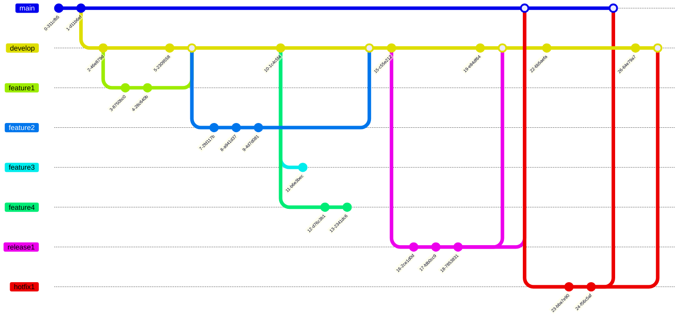

---
hide:
  - navigation
  - toc
---

# Exemple de Git Flow complet

```mermaid

gitGraph
   commit
   commit
   branch develop
   commit
   branch feature1
    commit
    commit
    checkout develop
    commit
    merge feature1
    branch feature2
    commit
    commit
    commit
    checkout develop
    commit
    branch feature3
    commit
    checkout develop
    branch feature4
    commit
    commit
    checkout develop
    merge feature2
    commit
    branch release1
    commit
    commit
    commit
    checkout develop
    commit
    merge release1
    checkout main
    merge release1
    checkout develop
    commit
    checkout main
    branch hotfix1
    commit
    commit
    checkout main
    merge hotfix1
    checkout develop
    commit
    merge hotfix1
```