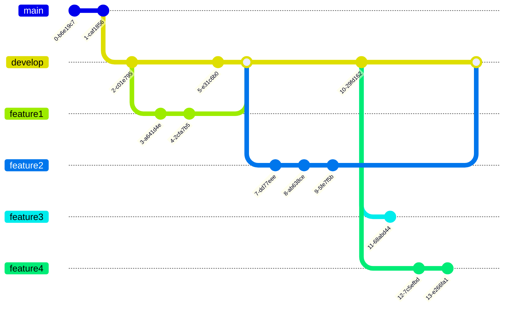
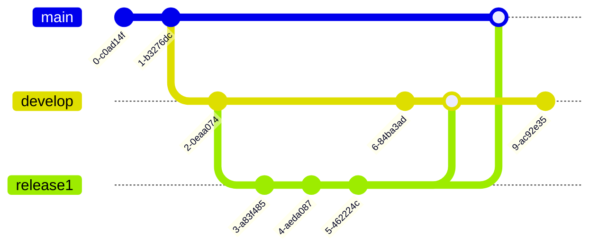
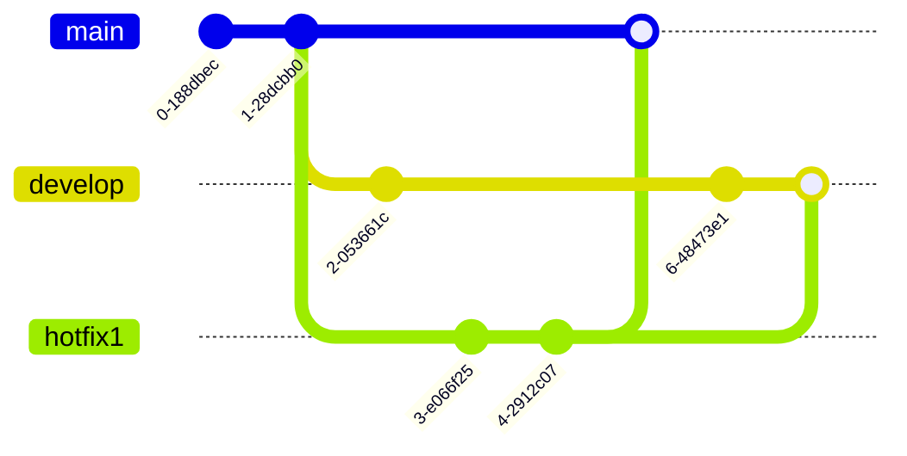

# git flow

Git flow est un modèle de gestion de branches. Il permet de gérer les branches d'un projet de manière structurée. 

Pour aller plus loin, vous pouvez consulter les sites suivant:

- [Tutoriel atlasian](https://www.atlassian.com/git/tutorials/comparing-workflows/gitflow-workflow),
- [A successful git branching model](https://nvie.com/posts/a-successful-git-branching-model/).

En résumé, il est composé de deux branches principales :

- `main` : branche principale du projet. Elle contient le code de production,
- `develop` : branche de développement. Elle contient le code en cours de développement.

et de branches secondaires :

- `feature/*` : branches de fonctionnalité. Elles contiennent le code d'une fonctionnalité en cours de développement,
- `release/*` : branches de release. Elles contiennent le code en cours de préparation pour une release,
- `hotfix/*` : branches de hotfix. Elles contiennent le code en cours de développement pour corriger un bug en production.
- `bugfix/*` : branches de bugfix. Elles contiennent le code en cours de développement pour corriger un bug en cours de développement.

## feature

Le schéma ci-dessous illustre la partie feature du git flow. Les développements se font sur la branche `develop` ou via des branches `feature` créées à partir de la branche `develop` pour développer des fonctionnalités. Une fois les fonctionnalités développées, les branches `feature` sont fusionnées avec la branche `develop`. On peut choisir d'autoriser le travail directement sur la branche `develop` sans passer par des branches `feature` ou bien l'interdire. Selon la taille du projet, il peut être préférable d'interdire le travail directement sur la branche `develop` pour éviter les conflits.

Il existe des solutions pour protéger les branches `develop` et `main` et empêcher les modifications directes sur ces branches (nous verrons comment protéger les branches sur github dans un prochain chapitre).

Dans le flow présenté ci-dessus, la `feature1` a été initialiser à partir de la brance `develop`, 2 commits ont eu lieu sur la branche `feature1` puis la branche `feature1` a été fusionnée avec la branche `develop`. 

La `feature2` a été initialiser à partir de la brance `develop`, 3 commits ont eu lieu sur la branche `feature2` puis la branche `feature2` a été fusionnée avec la branche `develop`. 

La `feature3` a été initialiser à partir de la brance `develop`, 1 commit a eu lieu sur la branche `feature3`.

La `feature4` a été initialiser à partir de la brance `develop`, 2 commits ont eu lieu sur la branche `feature4`.

Les branches `feature3` et `feature4` sont en cours de développement. Elles n'ont pas encore été fusionnées avec la branche `develop`. Elles peuvent encore être modifiées, voir supprimées si elles ne sont pas validées.

## release

Le schéma ci-dessous illustre la partie release du git flow. La release est une version du projet qui est prête à être mise en production. 

Une release est une version du projet qui est testée et qui est stable. On lui attribue un numéro de version. Par exemple, la version 1.0.0. (nous verrons comment gérer les versions dans un prochain chapitre). Les releases se font via des branches `release` créées à partir de la branche `develop` pour préparer une release. 

La release est une branche de préparation. Elle permet aussi de tester le code avant de le mettre en production. Si un bug est détecté, il est possible de corriger le bug sur la branche `release` et de fusionner la branche `release` avec la branche `develop`.

Une fois la release prête, la branche `release` est fusionnée avec la branche `develop` et la branche `main`.

## hotfix

Les hotfix se font via des branches `hotfix` créées à partir de la branche `main` pour corriger un bug en production. Une fois le hotfix développé, la branche `hotfix` est fusionnée avec la branche `develop` et la branche `main`.

Le `hotfix` est une branche de correction. La modification doit être ciblée et la durée de vie de la branche doit être courte. Le `hotfix` est une branche temporaire qui doit être supprimée une fois la correction appliquée. Elle doit être fusionnée avec la branche `develop` et la branche `main` le plus rapidement possible.

## bugfix

Les bugfix se font via des branches `bugfix` créées à partir de la branche `develop` pour corriger un bug en cours de développement. Une fois le bugfix développé, la branche `bugfix` est fusionnée avec la branche `develop`. Il s'agit du même principe que le `hotfix` mais pour corriger un bug en cours de développement.

**Résumé**

Le schéma [Git flow complet](./git-flow-complet.md) illustre le git flow complet. Les développements se font sur la branches `develop` ou via des branches `feature` créées à partir de la branche `develop` pour développer des fonctionnalités. Une fois les fonctionnalités développées, les branches `feature` sont fusionnées avec la branche `develop`.

Les releases se font via des branches `release` créées à partir de la branche `develop` pour préparer une release. Une fois la release prête, la branche `release` est fusionnée avec la branche `develop` et la branche `main`.

Les hotfix se font via des branches `hotfix` créées à partir de la branche `main` pour corriger un bug en production. Une fois le hotfix développé, la branche `hotfix` est fusionnée avec la branche `develop` et la branche `main`.