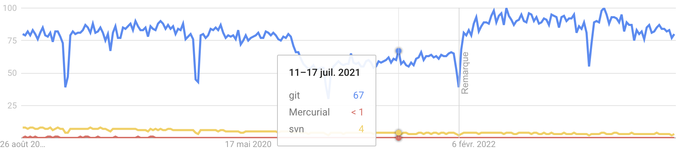

# Système de gestion de versions

Grâce à un système de gestion de version (**Version Control System** ou encore **Source Control Management**), on peut historiser le code source de nos applications. 

Mais pas uniquement, un SCM:

- permet de paralléliser plusieurs versions d’une même application
- sert de documentation sur l’historique du code. Chaque nouvelle modification de code est accompagnée d’un message. Ces messages doivent être rédigés avec soin et clarté
- permet de suivre précisément l’évolution du contenu des fichiers
- permet de revenir très simplement en arrière et à n’importe quel endroit de l’historique
- facilite la collaboration, permet de travailler simplement à plusieurs sur un même projet

Il existe deux types de SCM :

- **centralisé** : un serveur central contient l’historique du code et les développeurs travaillent en local sur leur machine. Ils doivent se connecter au serveur central pour récupérer les dernières modifications et pour envoyer les leurs. Exemple : SVN
- **décentralisé** : chaque développeur possède une copie complète de l’historique du code sur sa machine. Il n’y a pas de serveur central. Les développeurs peuvent travailler en local et envoyer leurs modifications à d’autres développeurs. Exemple : Git, Mercurial

Actuellement, le SCM le plus utilisé est Git. Il est décentralisé et très performant. Il est utilisé par de très nombreux projets open source et par de très nombreuses entreprises.



## Git
Git est un logiciel de gestion de versions décentralisé. C'est un logiciel libre créé par Linus Torvalds, auteur du noyau Linux, et distribué selon les termes de la licence publique générale GNU version 2.

Un dépôt git est un dossier qui contient les fichiers du projet ainsi que les informations de versionnage. Il est possible de créer un dépôt git à partir d'un dossier existant ou de créer un dossier à partir d'un dépôt git.

Le concept de commit est au coeur de git. Un commit est une sauvegarde de l'état des fichiers à un instant donné. Un commit représente un ensemble cohérent de modifications. 

### Installer git

Pour installer git, il faut télécharger le logiciel sur le site officiel : https://git-scm.com/downloads

### Configurer git

Avant de commencer à utiliser git, il faut configurer son nom et son email.

#### Configurer son nom
```bash
git config --global user.name "John Doe"
```

#### Configurer son email
```bash
git config --global user.email johndoe@example.com
```

#### Configurer son éditeur de texte
```bash
git config --global core.editor "code --wait"
```

#### Voir la configuration globale
```bash
git config  --global --list
```

#### Voir la configuration du dépôt
```bash
git config --list
```